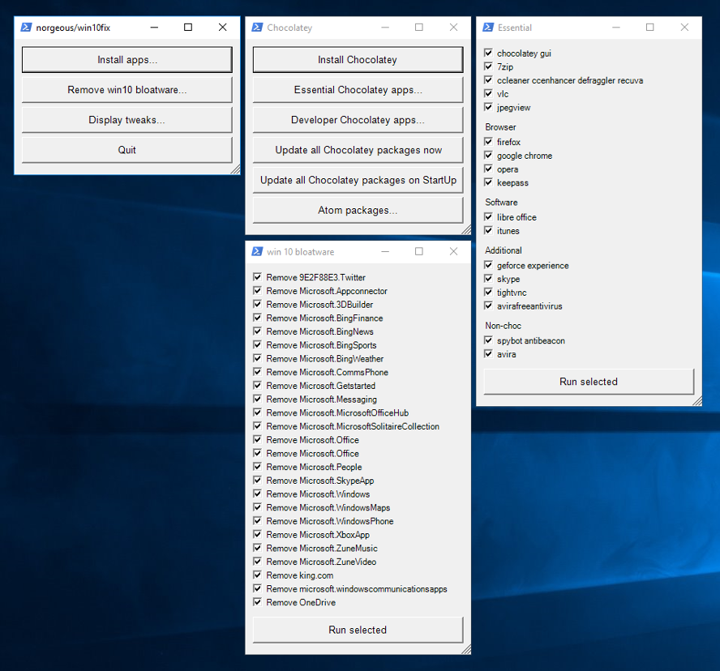

# win10fix
Semi-automate the procedure that needs to be done to a clean install of Windows 10


## Download
[Latest Unstable](archive/master.zip)

## Additional

### Git bash shortcut
in `.bashrc` add:
```
alias t='S:\\path\\too\\win10fix\\tool.bat'
```

### md2gui.ps1 documentation
[documentation](app/gui/apm.md)
